# Super Admin

## Login

Super admin login page is similar to other users, but it's have access to all the customers and it's modules.

user role for super admin is `sa`

Atleast one super admin user is required to access the application. Initial super admin need to be created using directly using mongodb compass /  mongo shell.

<figure markdown>
  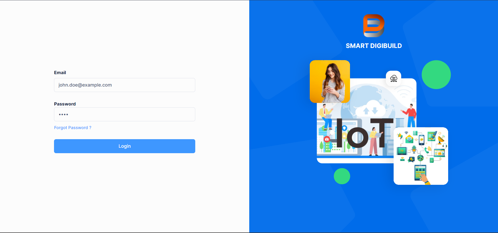{ width="800" }
  <figcaption>Login</figcaption>
</figure>

Note: In the future version we can move this as a part of initial setup, commands. 

## Dashboard

Currently we are not having any dashboard for super admin, but we can add it in the future versions. depend on the requirement.

<figure markdown>
  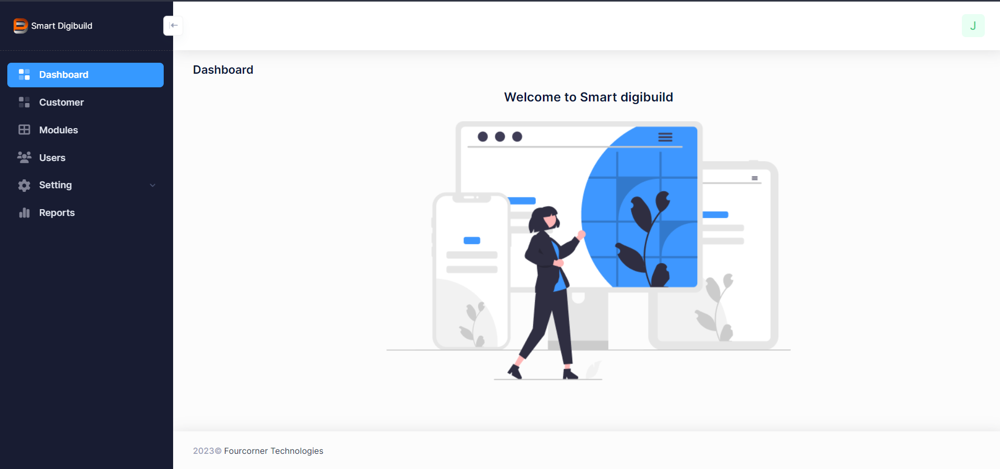{ width="800" }
  <figcaption>Super Admin Dashboard</figcaption>
</figure>

## Customer

Customer is the main entity in the application, and only super admin can create customer. During the customer creation, super admin need to provide the customer admin details.  Customer admin is the main user for the customer, and it's have access to all the modules and it's users. Refer custome admin pages for it's functionality.

### List Customer

It will list all the customers in the application, and super admin can perform CRUD operations on it.

<figure markdown>
  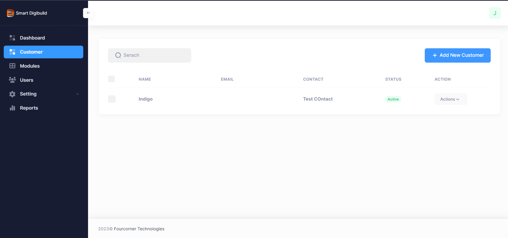{ width="800" }
  <figcaption>Customer List</figcaption>
</figure>

### Create Customer

Super admin can create customer using the below screen, and it's mandatory to provide customer admin details.

<figure markdown>
  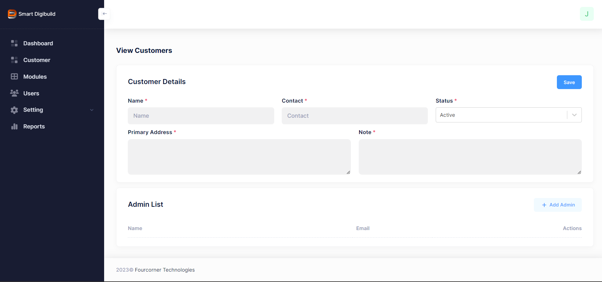{ width="800" }
  <figcaption>Create Customer</figcaption>
</figure>

<figure markdown>
  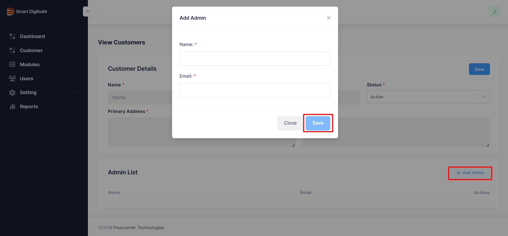{ width="800" }
  <figcaption>Add Customer Admin</figcaption>
</figure>

### Update Customer

Update customer screen are similar to create customer screen, but it's have edit buttons to update the customer details.

Note: Some test cases are failing during editing customer details, need to fix it.

### Delete Customer

Delete customer will delete the customer. 

<figure markdown>
  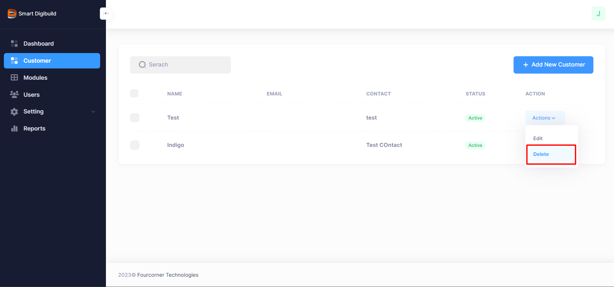{ width="800" }
  <figcaption>Delete Customer</figcaption>
</figure>

<figure markdown>
  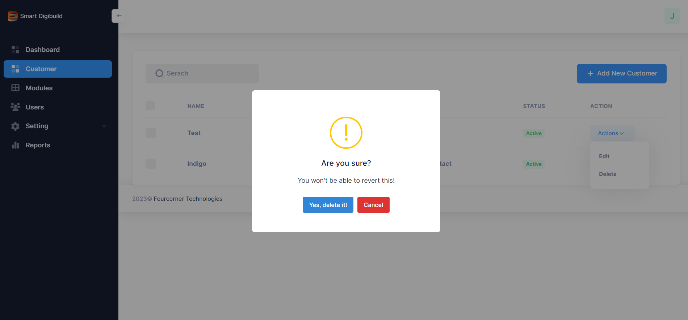{ width="800" }
  <figcaption>Delete Confirmation</figcaption>
</figure>

Note: Be careful while deleting the customer, it will delete all the customer data, and it's not recoverable.

## Module

TBD

## User

When super admin adds users it will be always super admin users, and it's have access to all the customers and it's modules.
Currently we are not having any user management for super admin, but we can add it in the future versions. depend on the requirement.

### List User

<figure markdown>
  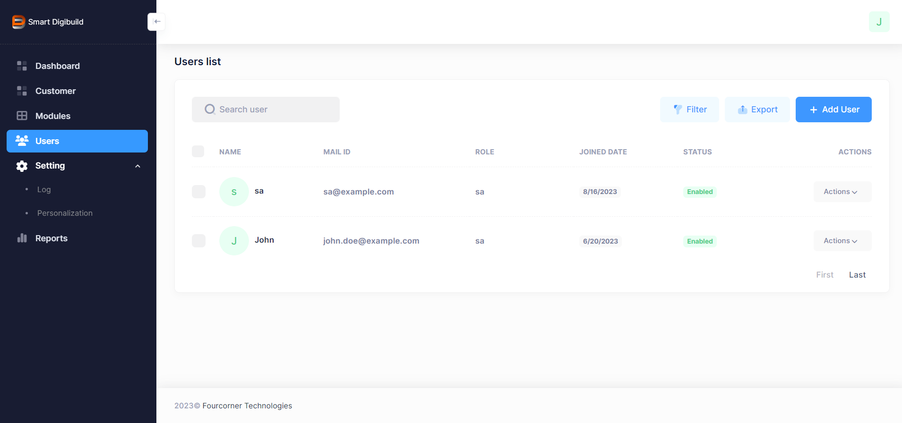{ width="800" }
<figcaption>Super admin user List</figcaption>
</figure>

### Create User

<figure markdown>
  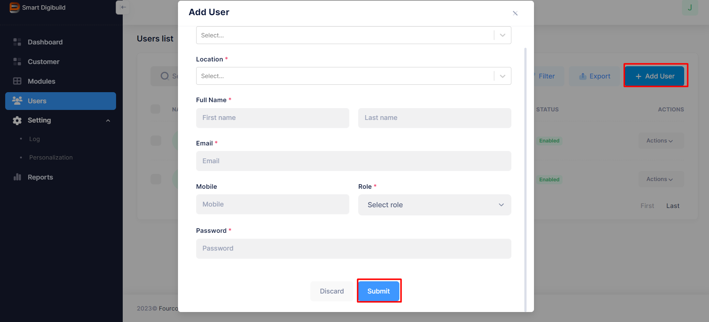{ width="800" }
<figcaption>Create User</figcaption>
</figure>

### Update User

Update user fields will have similar fields as a create user, but it's have edit buttons to update the user details.

<figure markdown>
  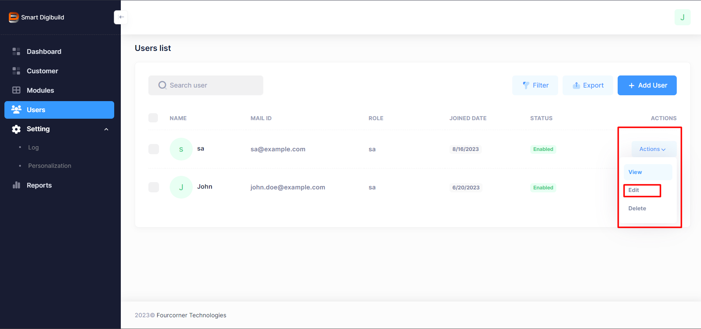{ width="800" }
<figcaption>Update User</figcaption>
</figure>

### Delete User

Delete user will delete the user.

## Logout

Logout will logout the user from the application, and it will redirect to login page.

<figure markdown>
  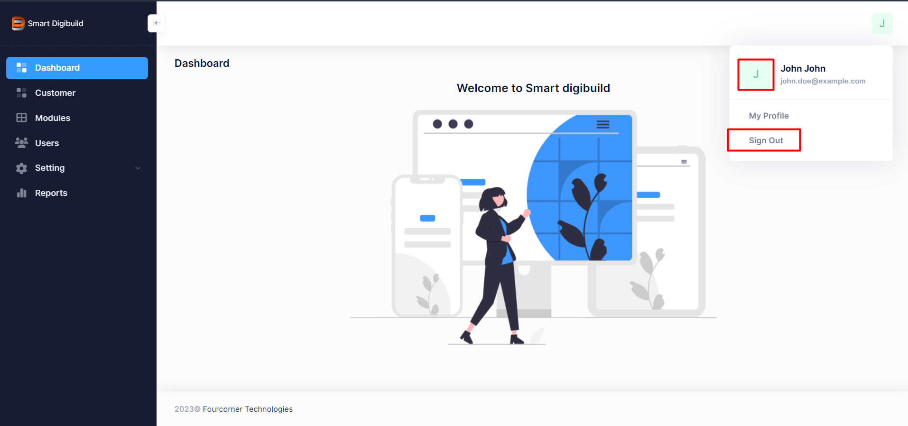{ width="800" }
<figcaption>Logout</figcaption>
</figure>

## Settings

TBD 

### Logs

TBD

### Personalization

TBD

## Reports

TBD

